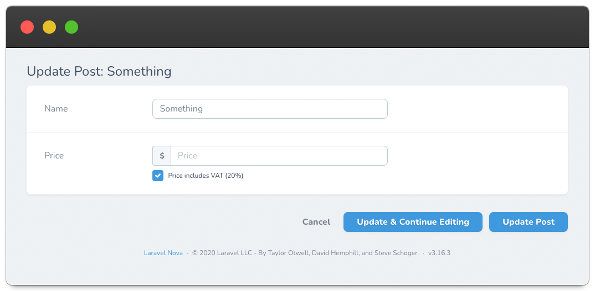

# Nova Currency VAT Field

[](https://packagist.org/packages/outl1ne/nova-currency-vat-field)
[](https://packagist.org/packages/outl1ne/nova-currency-vat-field)

This [Laravel Nova](https://nova.laravel.com/) package allows you to create and manage menus and menu items.

## Requirements

- `php: >=8.1`
- `laravel/nova: ^5.0`

## Features

An extension of Nova's default Currency field that provides a checkbox for toggling between VAT and non-VAT prices on the Form view.

Renders the default Currency field on Index and Detail views.

## Screenshots



## Installation

Install the package in to a Laravel app that uses [Nova](https://nova.laravel.com) via composer:

```bash
composer require outl1ne/nova-currency-vat-field
```

## Usage

```php
use Outl1ne\NovaCurrencyVatField\CurrencyVAT;

public function fields(Request $request) {
    CurrencyVAT::make('Price', 'price')
      ->VAT(20) // Required, otherwise VAT checkbox isn't rendered
      ->storedWithVAT() // By default with VAT
      ->storedWithoutVAT()
}
```

### Entering prices with VAT, storing them without

By default the checkbox starts out matching how the value is stored. To store the price without VAT, but have the form open with the checkbox checked and the price shown with VAT, use `displayedWithVAT()`:

```php
use Brick\Money\Context\CustomContext;

CurrencyVAT::make('Price', 'price')
  ->VAT(24)
  ->storedWithoutVAT()
  ->displayedWithVAT()
  ->storedDecimals(4) // Decimals of the stored price, defaults to the currency's
  ->context(new CustomContext(4)) // Required by Nova to format a 4 decimal value on Index and Detail views
```

A price without VAT that's rounded to the currency's decimals can not represent every price with VAT: with 24% VAT `10.00` is stored as `8.06`, which is `9.99` with VAT. Storing more decimals (`8.0645`) avoids that, which is what `storedDecimals()` is for. The column must be able to hold that many decimals and the option is not meant to be used with `asMinorUnits()`.

A field that is saved without changing its value or checkbox always sends back the exact value it was loaded with.

## Credits

- [Tarvo Reinpalu](https://github.com/tarpsvo)

## License

Nova Currency VAT Field is open-sourced software licensed under the [MIT license](LICENSE.md).
